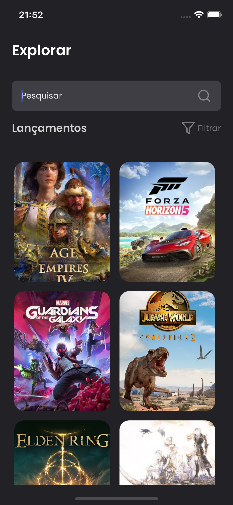
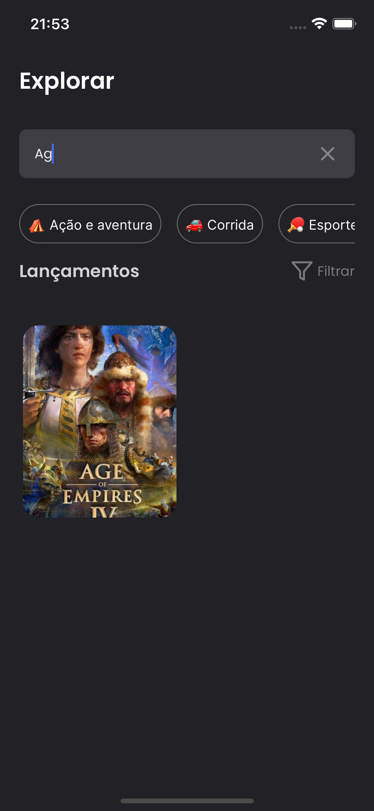

<p align="center">
  Aplicativo de listagem de jogos
</p>

<p align="center">
  <a href="#rocket-tecnologias">Tecnologias</a>&nbsp;&nbsp;&nbsp;|&nbsp;&nbsp;&nbsp;
  <a href="#art-layout">Layout</a>&nbsp;&nbsp;&nbsp;|&nbsp;&nbsp;&nbsp;
 <a href="#art-layout">Como usar</a>&nbsp;&nbsp;&nbsp;
</p>

## :rocket: Tecnologias

Este projeto foi desenvolvido com as seguintes tecnologias:

- [Typescript](https://www.typescriptlang.org/)
- [React Native](https://facebook.github.io/react-native/)
- [Redux](https://redux.js.org/)
- [Redux Saga](https://redux-saga.js.org/)
- [Redux Toolkit](https://redux-toolkit.js.org/)
- [Styled Components](https://www.styled-components.com/)
- [Axios](https://github.com/axios/axios)

---

## :art: Layout
 Você pode ver a publicação do layout no [#DailyUI 22](https://www.linkedin.com/posts/anaju-pereira_dailyui-dailyui-design-activity-6867247638971084800-j5ZK) <br/>
 Feito por: Ana Júlia Pereira :wave: [Entrar em contato!](https://www.linkedin.com/in/anaju-pereira/)

 <div style="display: flex; margin-bottom: 32px">
     
      
 </div>

---
## :information_source: Como usar

Você deve ter os seguintes programas instalados em seu sistema operacional. [Git](https://git-scm.com) | [Node.js](https://nodejs.org/en/) |  [Yarn](https://yarnpkg.com/) | [Json-Server](https://github.com/typicode/json-server)


```bash

# Clone o repositório
$ git clone https://github.com/yucorrea/explorer

# Navegue até a pasta do projeto
$ cd explorer

# Instale as dependências
$ yarn install or npm install

# Para iniciar o backend(FAKE)
$ json-server --watch db.json

 \{^_^}/ hi!
```

Desenvolvido por: Yuri Corrêa :wave: [Entrar em contato!](https://www.linkedin.com/in/yucorrea/)